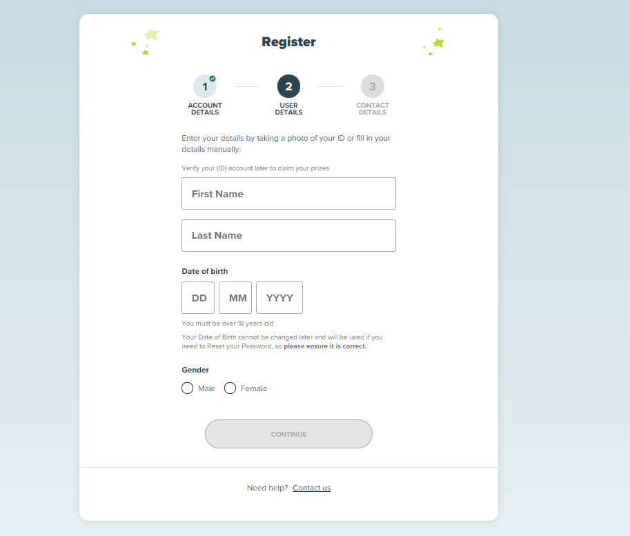

## Registration Form
---

* responsive design
  * form is framed only on large devices. for tablets and mobile the form is taking the entire width
  * background for lg screens is a gradient
* field validation
  * show inline validation errors on input focus out
  * continue button/stepper validation should be triggered on every change
  * 1st step
  * email - valid email
  * max 50 chars
  * password
    * 8 - 12 chars length
    * must not include 1st part of email (before @), first name or last name (case insensitive check)
    * must include at least 1 number
    * no special characters
  * special questions
    * only letters
    * 2 - 30 length
  * 2nd step
    * first name and last name
      * only letters, spaces, apostrophes and dashes
      * cannot have 2 or more  space/apostrophe/dash next to each other (--, '',  )
      * 2 to 30 chars
    * date of birth (dob)
      * must be a valid date
      * must be over 18
  * gender
  * 3rd step
    * confirmation is required
* must show validation errors under input
* stepper component must be clickable
  * can click on next step only if current is valid
* must be able to go between steps via browser navigation (back/forward buttons)

stack: nextjs, tailwing, typescript

* must develop using TDD approach
* create a simple header and footer of your choosing 
* pixel perfect is not required. Designed are simply there for directions - you can simplify them 
* work as a team

### Examples

